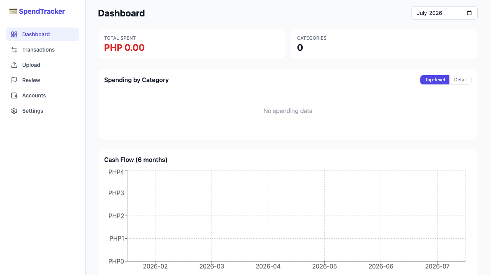
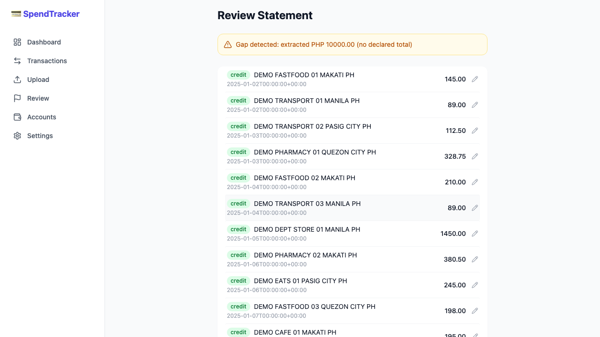
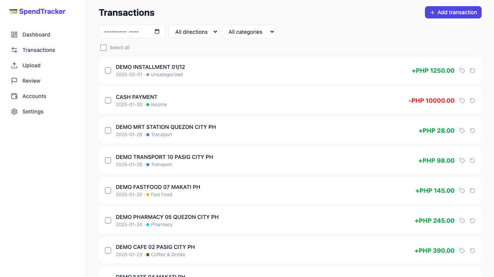
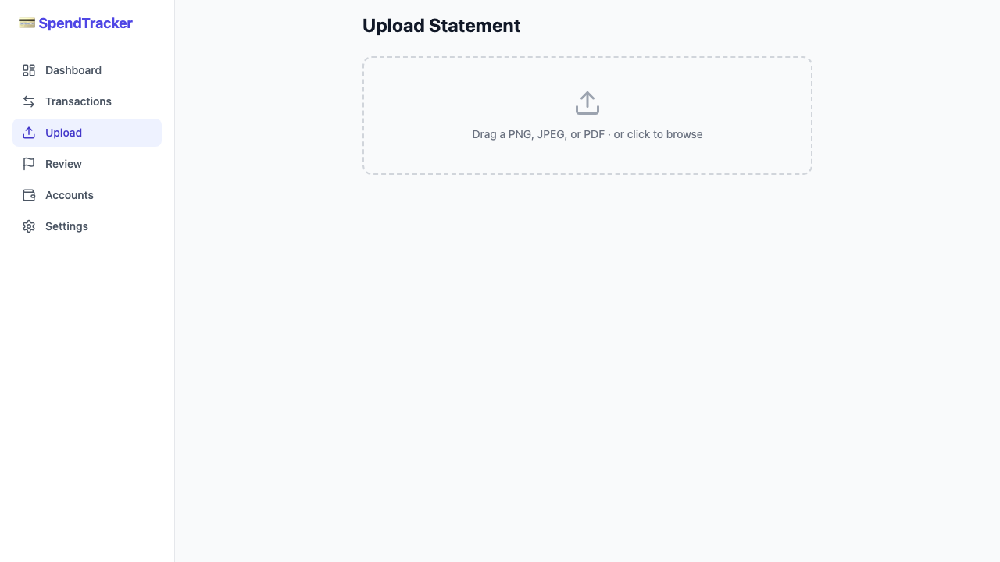
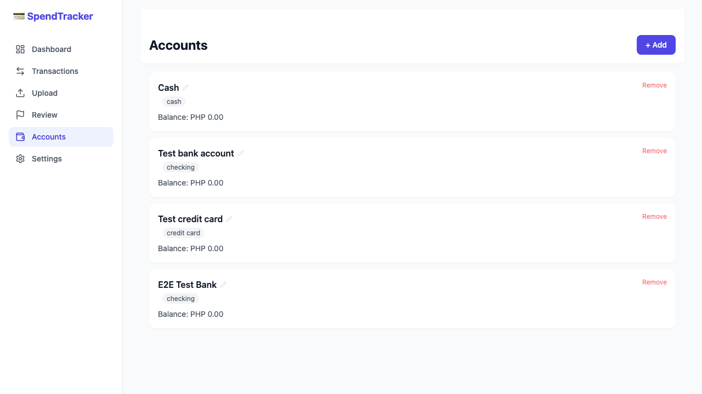
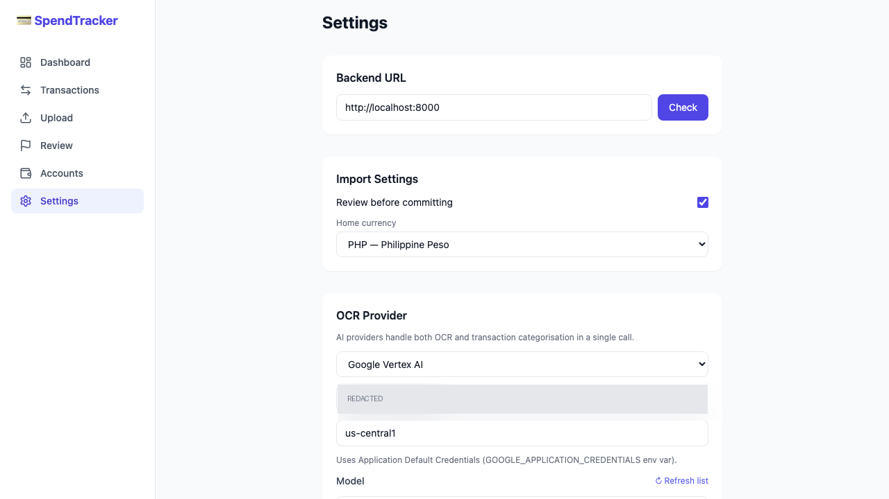

# SpendTracker

A self-hosted personal finance app that turns bank statement images and PDFs into a searchable, categorized transaction ledger — powered by OCR and AI.

Upload a photo of your credit card statement. The app extracts every transaction, tags debit vs credit, suggests categories, and lets you review before committing to your ledger.

---

## Screenshots

| Dashboard | Statement Review |
|---|---|
|  |  |

| Transactions (post-OCR) | Upload |
|---|---|
|  |  |

| Accounts | Settings |
|---|---|
|  |  |

---

## Features

**Statement import**
- Drag-and-drop upload of PNG, JPEG, or PDF bank statements
- OCR pipeline: Tesseract (offline) or AI vision — Claude, OpenAI, Google Gemini, Google Vertex AI
- AI providers categorize transactions in the same call as OCR (no second round-trip)
- Review-before-commit workflow: inspect and edit extracted rows before they hit your ledger
- Duplicate detection: flags suspected duplicates within a ±3-day window

**Transaction ledger**
- Full audit trail: every financial edit creates a reversal + correction pair
- Single and bulk reversal with selectable reason codes
- Inline edit: amount, date, direction, description, category
- Filter by month, direction (debit / credit), and category
- Multi-currency support with home-currency display

**Accounts & portfolio**
- Multiple account types: checking, savings, credit card, cash, broker
- Investment portfolio view per broker account
- Account fingerprinting: auto-links uploaded statements to the correct account

**Analytics**
- Spending by category — donut chart with top-level / detail toggle
- Cash flow over 6 months — bar chart
- Per-month totals and category breakdown

**Settings**
- Switch OCR provider without restarting — changes take effect on the next upload
- Home currency selector
- Review-before-commit toggle (on = staging queue, off = direct commit)

**Infrastructure**
- Fully Dockerized — one `make up` starts everything
- Non-blocking OCR: Tesseract runs in a thread pool, never stalls the API
- Exchange rate service for multi-currency conversion
- PWA manifest + Capacitor targets for iOS and Android

---

## Tech Stack

| Layer | Tech |
|---|---|
| Backend | Python, FastAPI, SQLAlchemy (async), Alembic |
| Database | PostgreSQL 16 |
| OCR — offline | Tesseract + pdfplumber + OpenCV |
| OCR — AI | Anthropic Claude, OpenAI GPT-4o, Google Gemini, Google Vertex AI |
| Frontend | Next.js 14, TypeScript, Tailwind CSS, TanStack Query, Recharts |
| Mobile | Capacitor (iOS / Android), PWA |
| Infra | Docker, docker-compose, Nginx |
| Testing | pytest (backend), Playwright E2E (frontend) |

---

## Quick Start

### Prerequisites

- [Docker Desktop](https://www.docker.com/products/docker-desktop/)
- Node.js 20+ (for frontend dev / E2E tests)

### 1. Clone and configure

```bash
git clone <repo-url>
cd spending-tracker
cp .env.example .env
```

The defaults in `.env` work out of the box with Tesseract OCR. To use an AI provider, add the relevant key:

```env
# Pick one:
OCR_PROVIDER=tesseract     # no key needed, works offline
OCR_PROVIDER=claude        # set ANTHROPIC_API_KEY
OCR_PROVIDER=openai        # set OPENAI_API_KEY
OCR_PROVIDER=gemini        # set GEMINI_API_KEY
OCR_PROVIDER=vertex        # set GOOGLE_PROJECT_ID + Application Default Credentials
```

### 2. Build and start

```bash
make build     # build Docker images
make migrate   # apply database migrations
make up        # start all services (backend + db + nginx)
```

App is now at **http://localhost**.  
Backend API docs: **http://localhost/api/docs**

### 3. Start frontend dev server (optional)

The Docker setup serves a production frontend build. For hot-reload development:

```bash
make frontend-dev   # Next.js dev server at http://localhost:3000
```

---

## Make Commands

| Command | Description |
|---|---|
| `make build` | Build Docker images |
| `make up` | Start all services (detached) |
| `make dev` | Start all services (attached, with logs) |
| `make down` | Stop all services |
| `make logs` | Tail service logs |
| `make migrate` | Apply Alembic migrations |
| `make revision msg="..."` | Generate a new migration |
| `make test` | Run backend test suite |
| `make frontend-dev` | Start Next.js dev server |
| `make shell-backend` | Shell into the backend container |
| `make shell-db` | psql into the database |

---

## Running Tests

**Backend:**
```bash
make test
```

**Frontend E2E (Playwright):**
```bash
cd frontend
npm install
npx playwright install chromium
npx playwright test
```

Screenshots are captured for every test and written to `frontend/test-results/`. The real-statement OCR tests require a bank statement image placed at `frontend/tests/e2e/fixtures/private/statement.png` (gitignored) — all other tests run without it.

---

## Environment Variables

| Variable | Required | Default | Description |
|---|---|---|---|
| `DATABASE_URL` | Yes | see `.env.example` | PostgreSQL connection string |
| `OCR_PROVIDER` | No | `tesseract` | `tesseract` · `claude` · `openai` · `gemini` · `vertex` |
| `ANTHROPIC_API_KEY` | If `claude` | — | Anthropic API key |
| `OPENAI_API_KEY` | If `openai` | — | OpenAI API key |
| `GEMINI_API_KEY` | If `gemini` | — | Google Gemini API key |
| `GOOGLE_PROJECT_ID` | If `vertex` | — | GCP project ID for Vertex AI |
| `APP_SECRET` | No | — | Secret for account fingerprinting (32+ chars) |
| `STORAGE_BACKENDS` | No | `local` | Comma-separated: `local`, `s3`, `gcs` |

See `.env.example` for the full list including S3/GCS storage options.

---

## Project Structure

```
spending-tracker/
├── backend/
│   ├── src/
│   │   ├── api/routes/         # FastAPI route handlers
│   │   ├── core/               # Config + settings
│   │   ├── db/                 # DB session
│   │   └── domain/
│   │       ├── models/         # SQLAlchemy ORM models
│   │       └── services/       # OCR pipeline, categorizer, parser
│   ├── alembic/                # DB migrations
│   ├── tests/
│   └── Dockerfile
├── frontend/
│   ├── src/
│   │   ├── app/                # Next.js app-router pages
│   │   ├── components/         # UI + charts
│   │   ├── hooks/              # TanStack Query hooks
│   │   └── lib/                # API client, types
│   └── tests/e2e/              # Playwright tests
├── design/                     # Design artifacts (see below)
├── docs/screenshots/           # README screenshots (from E2E runs)
├── docker-compose.yml
├── Makefile
└── .env.example
```

---

## Design & Planning Artifacts

This project was built with [Claude Code](https://claude.ai/code). The full planning trail is committed openly in `design/`:

| Path | Contents |
|---|---|
| `design/features/spending-tracker/proposal.md` | Original feature proposal — epics, stories, acceptance criteria |
| `design/features/spending-tracker/contracts/` | API contract, DB schema, OCR pipeline spec, frontend UX spec, currency spec |
| `design/features/cloud-storage-backends/` | S3/GCS storage backend proposal + interface contract |
| `design/audits/` | Post-implementation audit findings |

The step-by-step execution ledger (which wave ran what, pass/fail verdicts per step) is visible in the git history via `.claude/task/step-ledger.md` — it was removed from the working tree after the build completed but is readable in earlier commits.

---

## Mobile (Capacitor)

```bash
make cap-ios        # build + open in Xcode
make cap-android    # build + open in Android Studio
```

---

## License

MIT — see [LICENSE](LICENSE).
